class: middle hide_logo

```{r setup, include=FALSE}
options(htmltools.dir.version = FALSE)
options(knitr.table.format = "html") 
# require(DT)
xaringanExtra::use_xaringan_extra(c("tile_view", "animate_css", "tachyons", "panelset"))
xaringanExtra::use_webcam(width = 1100, height = 800)
```

```{r xaringan-logo, echo=FALSE}
# use logo
xaringanExtra::use_logo(
  image_url = "https://upload.wikimedia.org/wikipedia/commons/6/66/ESR_SFC_logo.png",
  width = "138px",
  height = "87px",
  position = xaringanExtra::css_position(bottom = "1px", right = "1.5em"),
  link_url = "https://www.esr.cri.nz/",
  exclude_class = c("title-slide", "inverse", "hide_logo")
)
```

# .center[Advocates for reproducible research...]

## .center[Where possible all presentations and code are available online]

<br />

<p>
.center[


]
</p>

<br />

.center[[sirselim.github.io/presentations](http://sirselim.github.io/presentations)]

<!-- SVG Icons are from https://simpleicons.org -->
<footer class="pv3 ph3 ph5-ns tc">
  <a class="link near-black hover-blue dib h2 w2 mr3" href="https://github.com/sirselim" title="GitHub">
    <svg fill="currentColor" xmlns="http://www.w3.org/2000/svg" viewBox="0 0 16 16" fill-rule="evenodd" clip-rule="evenodd" stroke-linejoin="round" stroke-miterlimit="1.414"><path d="M8 0C3.58 0 0 3.582 0 8c0 3.535 2.292 6.533 5.47 7.59.4.075.547-.172.547-.385 0-.19-.007-.693-.01-1.36-2.226.483-2.695-1.073-2.695-1.073-.364-.924-.89-1.17-.89-1.17-.725-.496.056-.486.056-.486.803.056 1.225.824 1.225.824.714 1.223 1.873.87 2.33.665.072-.517.278-.87.507-1.07-1.777-.2-3.644-.888-3.644-3.953 0-.873.31-1.587.823-2.147-.083-.202-.358-1.015.077-2.117 0 0 .672-.215 2.2.82.638-.178 1.323-.266 2.003-.27.68.004 1.364.092 2.003.27 1.527-1.035 2.198-.82 2.198-.82.437 1.102.163 1.915.08 2.117.513.56.823 1.274.823 2.147 0 3.073-1.87 3.75-3.653 3.947.287.246.543.735.543 1.48 0 1.07-.01 1.933-.01 2.195 0 .215.144.463.55.385C13.71 14.53 16 11.534 16 8c0-4.418-3.582-8-8-8"/></svg>
  </a>
  <a class="link hover-blue near-black dib h2 w2 mr3" href="https://twitter.com/miles_benton" title="Twitter">
    <svg fill="currentColor" xmlns="http://www.w3.org/2000/svg" viewBox="0 0 16 16" fill-rule="evenodd" clip-rule="evenodd" stroke-linejoin="round" stroke-miterlimit="1.414"><path d="M16 3.038c-.59.26-1.22.437-1.885.517.677-.407 1.198-1.05 1.443-1.816-.634.375-1.337.648-2.085.795-.598-.638-1.45-1.036-2.396-1.036-1.812 0-3.282 1.468-3.282 3.28 0 .258.03.51.085.75C5.152 5.39 2.733 4.084 1.114 2.1.83 2.583.67 3.147.67 3.75c0 1.14.58 2.143 1.46 2.732-.538-.017-1.045-.165-1.487-.41v.04c0 1.59 1.13 2.918 2.633 3.22-.276.074-.566.114-.865.114-.21 0-.416-.02-.617-.058.418 1.304 1.63 2.253 3.067 2.28-1.124.88-2.54 1.404-4.077 1.404-.265 0-.526-.015-.783-.045 1.453.93 3.178 1.474 5.032 1.474 6.038 0 9.34-5 9.34-9.338 0-.143-.004-.284-.01-.425.64-.463 1.198-1.04 1.638-1.7z" fill-rule="nonzero"/></svg>
  </a>
  <a class="link hover-blue near-black dib h2 w2 mr3" href="https://scholar.google.co.nz/citations?user=iEhBavEAAAAJ&hl=en" title="Google Scholar">
    <svg fill="currentColor" xmlns="http://www.w3.org/2000/svg" viewBox="0 0 24 24" fill-rule="evenodd" clip-rule="evenodd" stroke-linejoin="round" stroke-miterlimit="1.414"><path d="M12 24a7 7 0 1 1 0-14 7 7 0 0 1 0 14zm0-24L0 9.5l4.838 3.94A8 8 0 0 1 12 9a8 8 0 0 1 7.162 4.44L24 9.5z" fill-rule="nonzero"/></svg>
  </a>
  <a class="link hover-blue near-black dib h2 w2 mr3" href="http://orcid.org/0000-0003-3442-965X" title="ORCID">
    <svg fill="currentColor" xmlns="http://www.w3.org/2000/svg" viewBox="0 0 24 24" fill-rule="evenodd" clip-rule="evenodd" stroke-linejoin="round" stroke-miterlimit="1.414"><path d="M12 0C5.372 0 0 5.372 0 12s5.372 12 12 12 12-5.372 12-12S18.628 0 12 0zM7.369 4.378c.525 0 .947.431.947.947s-.422.947-.947.947a.95.95 0 0 1-.947-.947c0-.525.422-.947.947-.947zm-.722 3.038h1.444v10.041H6.647V7.416zm3.562 0h3.9c3.712 0 5.344 2.653 5.344 5.025 0 2.578-2.016 5.025-5.325 5.025h-3.919V7.416zm1.444 1.303v7.444h2.297c3.272 0 4.022-2.484 4.022-3.722 0-2.016-1.284-3.722-4.097-3.722h-2.222z" fill-rule="nonzero"/></svg>
  </a>
</footer>

---
layout: false
class: middle

<p>
.center[

]
</p>

.small[.center[
(image source: [nanoporetech](https://nanoporetech.com/about-us/news/oxford-nanopore-announces-ps100-million-140m-fundraising-global-investors))
]]

???

flongle: ~$500 USD for 5
1 might be enough for a metagenome

minION: $1000 

smidgION: still just a concept

gridION: ~$50K

promethION: ~$230K

---
layout: false
class: middle hide_logo

<center>
<iframe width="1000" height="562" src="https://www.youtube.com/embed/RcP85JHLmnI" frameborder="0" allow="accelerometer; autoplay; clipboard-write; encrypted-media; gyroscope; picture-in-picture" allowfullscreen></iframe>
<br />
&copy; Oxford Nanopore Technologies
</center>

---
layout: false
class: middle

# Example squiggle plot


.small[.center[
(image source: [tombo manual](https://nanoporetech.github.io/tombo/plotting.html))
]]

???

What we 'see' when DNA passes through the pores.

---
layout: false
class: middle

# GPUs make a big difference

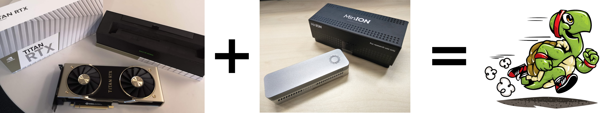

---
class: middle

# Let's step back a couple of years 

.pull.right[
.large[<span style="color:#3498DB">... **a personal story** ...</span>]
]

---
class: middle

<p>
.center[


]
</p>

---
class: top

# what are we doing?

.large[
Portable ‘real-time’ sequencing for the masses
]

--

* <span style="color:#3498DB">**the idea**</span>

  * low cost (< many mobile phones)
  * accessible
  * portable
  * robust (...may have "performed" a drop test...)
  * fun!

--
  
* <span style="color:#3498DB">**example use cases**</span>

  * field sequencing (real-time monitoring, forensics, agriculture, waterways, ...)
  * clinical settings
  * community outreach / teaching

--

.center[
Community Science | "United in Data" -> <span style="color:#3498DB">**"LEVEL UP"**</span>
]

---
class: middle

# Our experiences with the Xavier [(link)](https://hackmd.io/@Miles/HkumH7sBH)

.pull-left[.right[
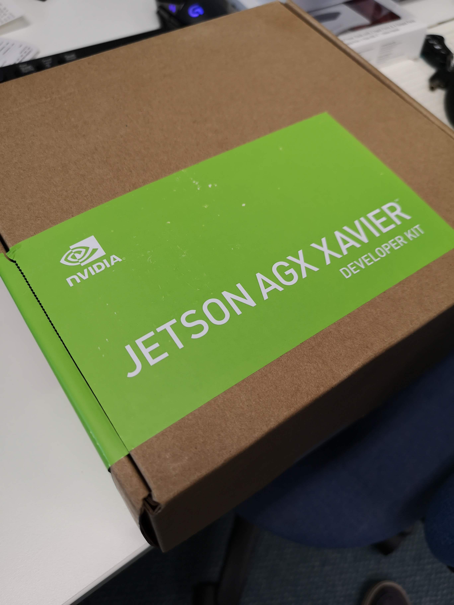
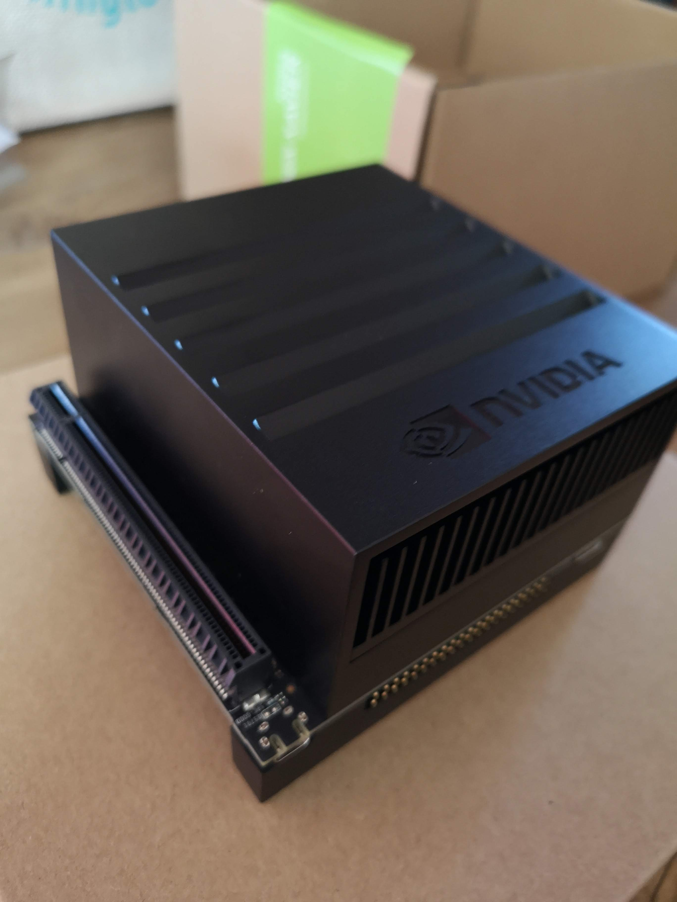
]]

.pull-right[.left[
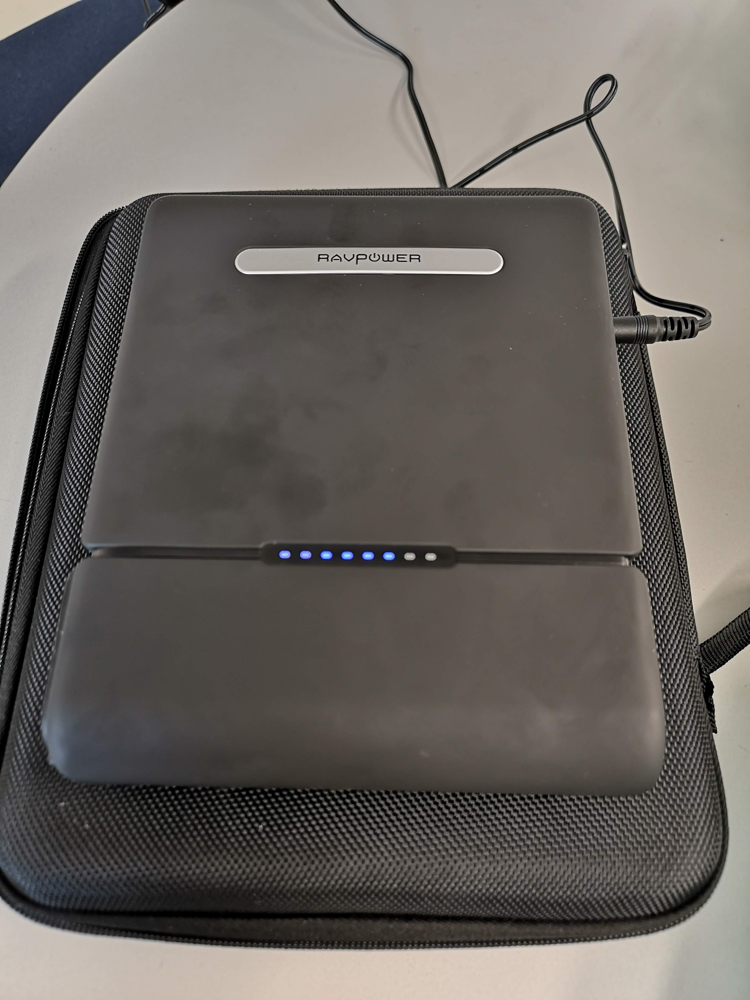
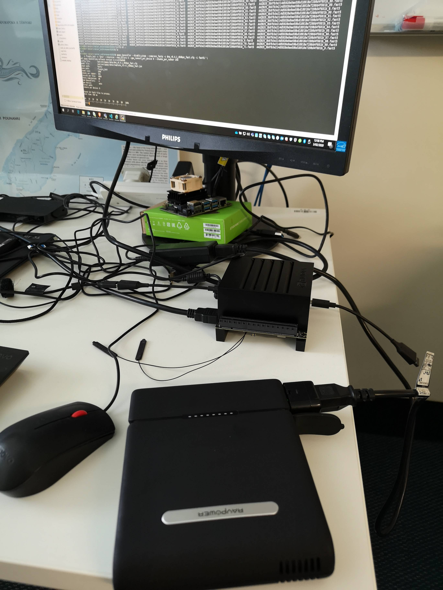
]]

.center[
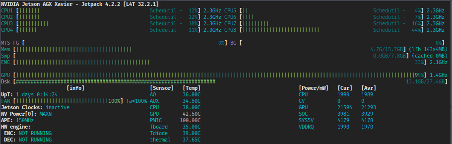
]

???

Talk about the Xavier specs:

 * 8 core arm 
 * 16 GB of RAM
 * 512 CUDA core and 64 tensor cores
 * 512 GB SSD NVMe

---
class: middle

# Community engagement leading to empowerment

.pull.right[
<span style="color:#3498DB">... **a few stories of the journey** ...</span>
]

---

# So how about unlocking it for everyone?

.center[
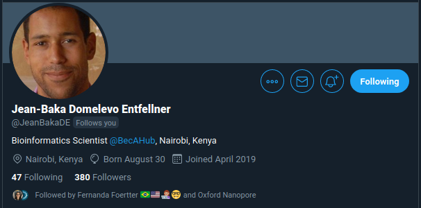
]

---

# The unboxing and a slight snag

<article class="cf">
  <div class="fl w-50 bg-white tc">
    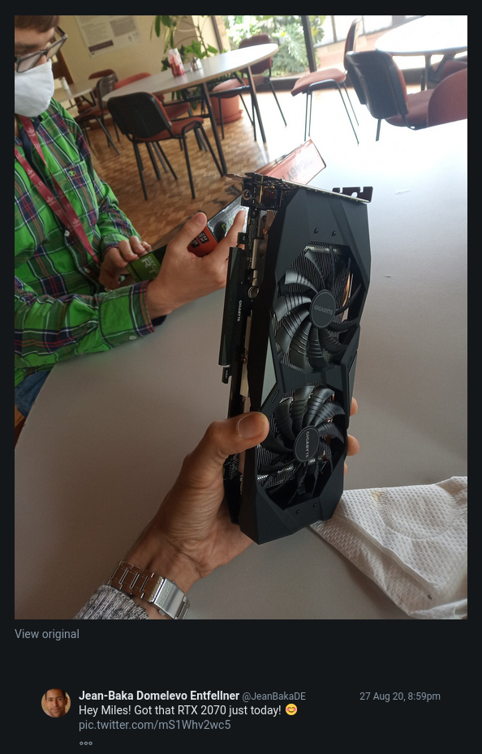
  </div>
  <div class="fl w-50 bg-white tc">
    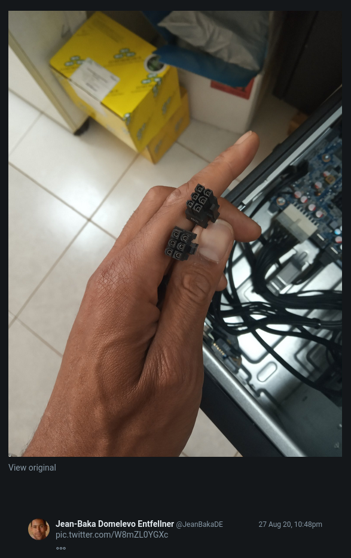
  </div>
</article>

---

# Success

<article class="cf">
  <div class="fl w-50 bg-white tc">
    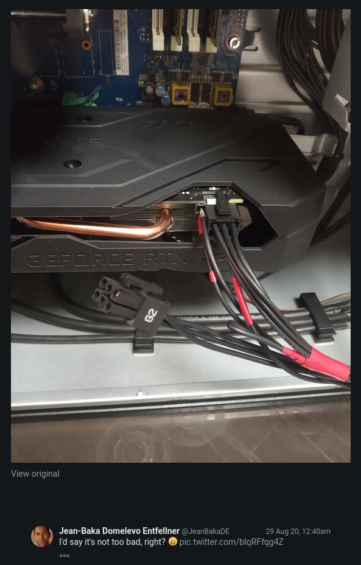
  </div>
  <div class="fl w-40 bg-white tc">
    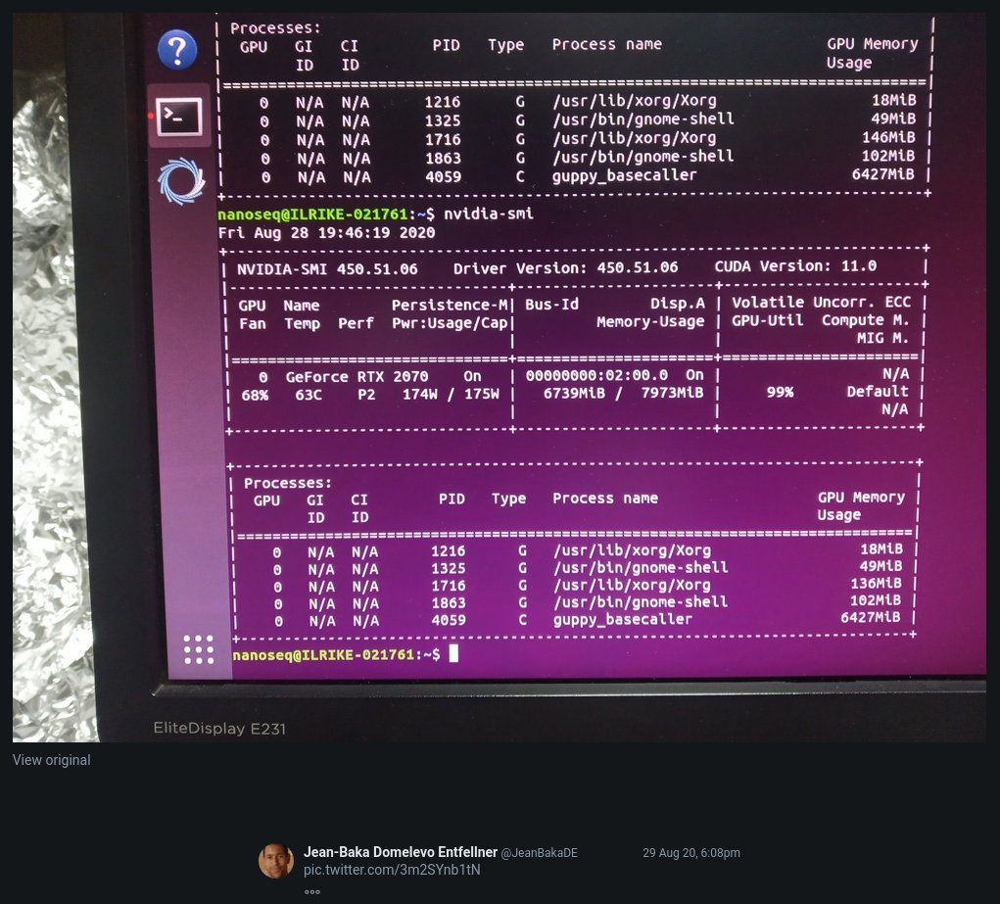
  </div>
  <div class="fl w-40 bg-white tc">
    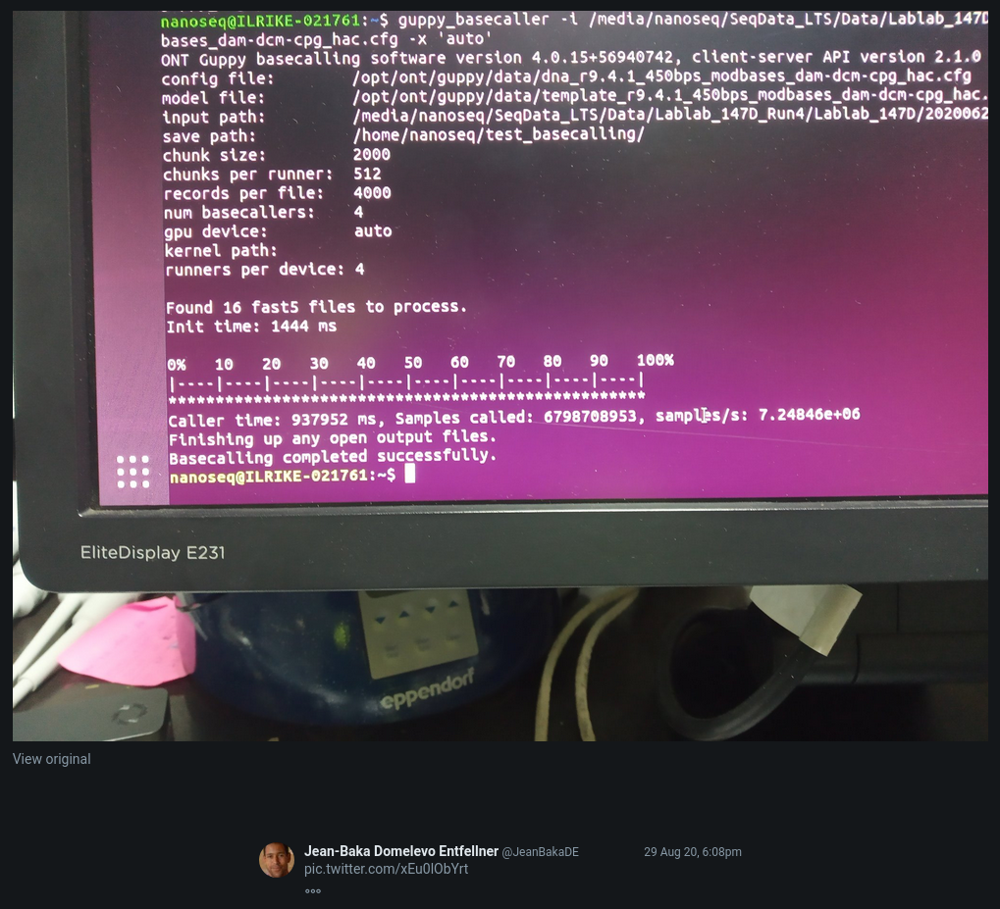
  </div>
</article>

---
class: middle

# A global cast of many

* [***Kenya***] Jean-Bakka Domelevo Entfellner ([@JeanBakaDE](https://twitter.com/JeanBakaDE))

* [***USA***] John Erb-Downward ([@Bombanat](https://twitter.com/bombanat))

* [***Italy***] Luigi Faino ([@lfaino](https://twitter.com/lfaino))

* [***Switzerland***] Jürgen Hench

* [***USA***] Nvidia Clara Team ([Clara AGX site](https://developer.nvidia.com/clara-agx-devkit))

<br >

.center[You can follow the story here: [GitHub Gist - Xavier basecalling notes](https://gist.github.com/sirselim/2ebe2807112fae93809aa18f096dbb94)]

---

# ~~The future...~~

.center[
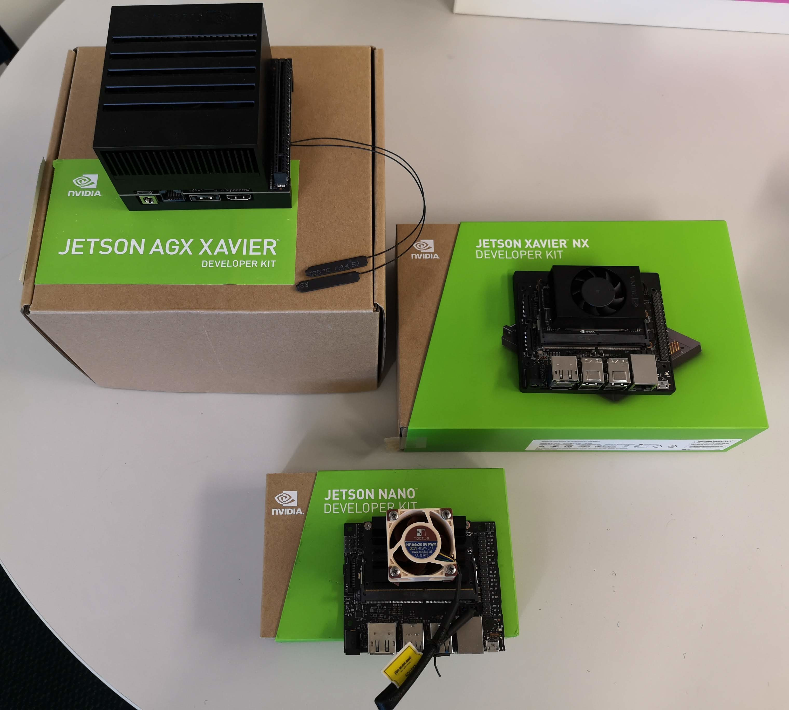
]

.center[

]

---

# ~~The (not so distant) future...~~

<article class="cf">
  <div class="fl w-50 bg-white tc">
    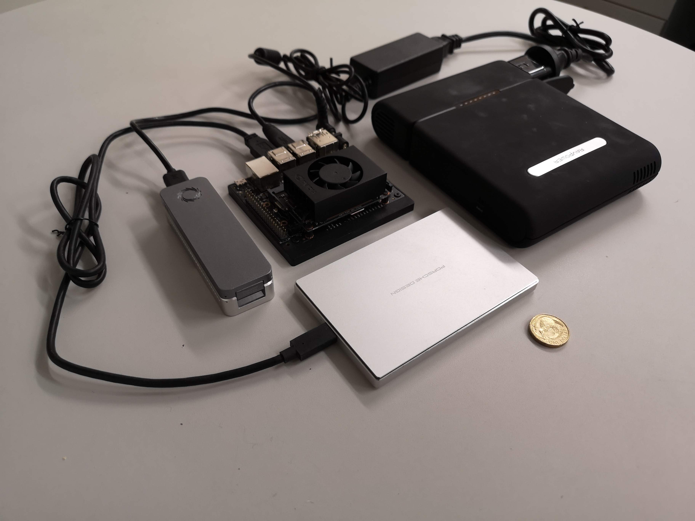
  </div>
  <div class="fl w-50 bg-white tc">
    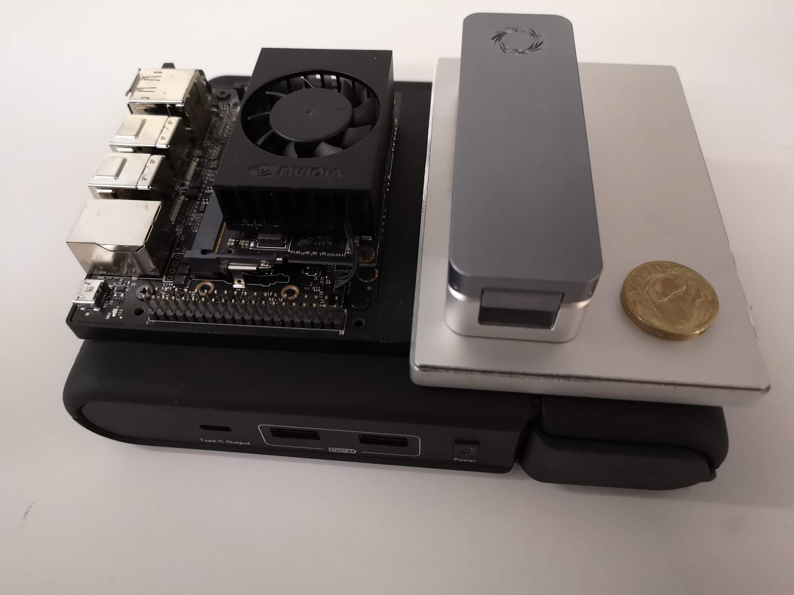
  </div>
</article>

.center[

]

---
class: hide_logo

# The present!

<article class="cf">
    <div class="fl w-100 w-33-m w-50-l pa1">
    <a class="db aspect-ratio aspect-ratio--1x1">
      <span role="img" style="background-image:url(images/xavier-ont.gif);" class="bg-center cover aspect-ratio--object"></span>
    </a>
  </div>
  <div class="fl w-50 w-33-m w-25-l pa1">
    <a class="db aspect-ratio aspect-ratio--1x1">
      <span role="img" style="background-image:url(images/xavnx_board.jpg);" class="bg-center cover aspect-ratio--object"></span>
    </a>
  </div>
  <div class="fl w-50 w-33-m w-25-l pa1">
    <a class="db aspect-ratio aspect-ratio--1x1">
      <span role="img" style="background-image:url(images/xavnx_screen.jpg);" class="bg-center cover aspect-ratio--object"></span>
    </a>
  </div>
  <div class="fl w-50 w-33-m w-25-l pa1">
    <a class="db aspect-ratio aspect-ratio--1x1">
      <span role="img" style="background-image:url(images/Matt_hand.jpg);" class="bg-center cover aspect-ratio--object"></span>
    </a>
  </div>
  <div class="fl w-50 w-33-m w-25-l pa1">
    <a class="db aspect-ratio aspect-ratio--1x1">
      <span role="img" style="background-image:url(images/full_kit.jpg);" class="bg-center cover aspect-ratio--object"></span>
    </a>
  </div>
</article>

---

# Hot off the press!

.center[
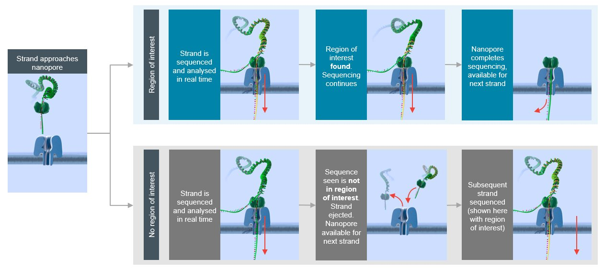
<br />
&copy; Oxford Nanopore Technologies
]
.center[
<br />
Jürgen Hench, Basel, Switzerland ([cancer methylation sequencing](https://gist.github.com/sirselim/2ebe2807112fae93809aa18f096dbb94#gistcomment-3547889))
]

---

# Hot off the press!

<article class="cf">
  <div class="fl w-50 bg-white tc">
    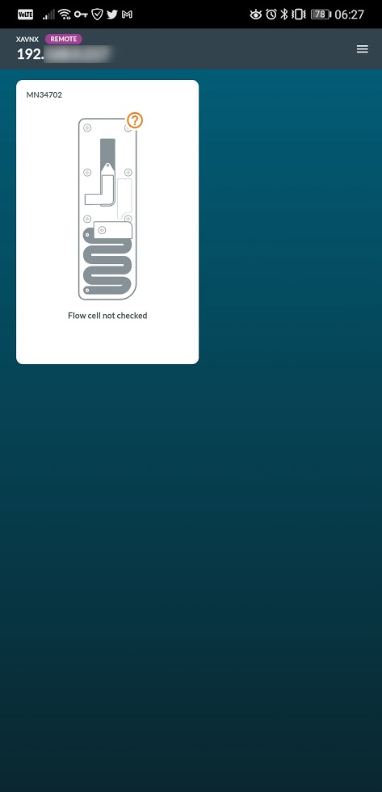
  </div>
  <div class="fl w-50 bg-white tc">
    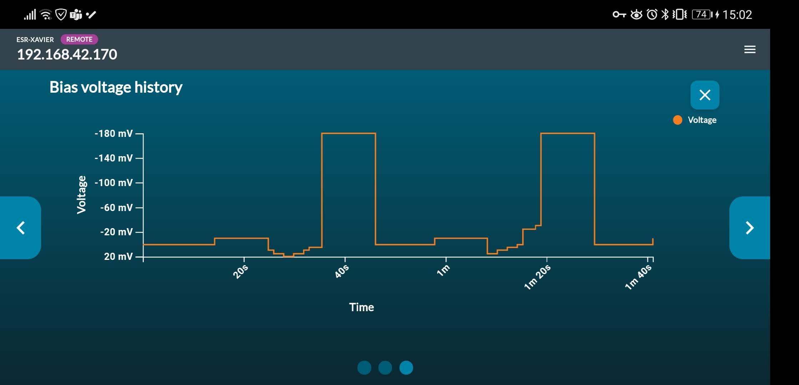
    <br>
    <br>
    <br>
    <br>
    <br>
    <b>Can now control all of this from our pockets!</b>  
    <br>
    <br>
    Available now on <a href="https://play.google.com/store/apps/details?id=com.nanoporetech.minknowui&hl=en_CA&gl=US" target="blank">Android</a> and <a href="https://apps.apple.com/us/app/minknow/id1504645283" target="blank">iOS</a>
  </div>
</article>

---

## Our experiences with the Jeston Xaviers

.small[
#### Article in the NZ Herald
  * The Genius of Genomics ([link](https://www.nzherald.co.nz/nz/the-genius-of-genomics-the-revolution-that-helped-nz-quash-covid-19/EFJWSHSL3TTYNNKYA5WEROIKHY/))
  * Story also on ESR website ([link](https://www.esr.cri.nz/home/about-esr/media-releases/esr-scientists-showcase-benefits-of-collaboration-for-rapid-dna-sequencing/))

#### Jetson Nanopore Sequencing 
  * [A place to collate notes and resources of our journey into porting nanopore sequencing over to accessible, portable technology](https://github.com/sirselim/jetson_nanopore_sequencing)
    * up to date information, including parts list and set up guide

#### eResearch 2020 presentation 
  * [Assessing the potential of ~~autonomous AI devices~~ cool tech for portable real-time sequencing](https://sirselim.github.io/presentations/eResearch_2020/eResearch_presentation_livedemo_2020#1)
    * live base-calling and presentation run from the Xavier

#### Xavier AGX setup and notes
  * [Xavier AGX unboxing and setup](https://hackmd.io/@Miles/HkumH7sBH)

#### Xavier base-calling benchmarking and notes
  * [Xavier benchmarking](https://gist.github.com/sirselim/2ebe2807112fae93809aa18f096dbb94#file-basecalling_notes-md)
]

---

# If you're interested in GPUs and genomics...

.center[
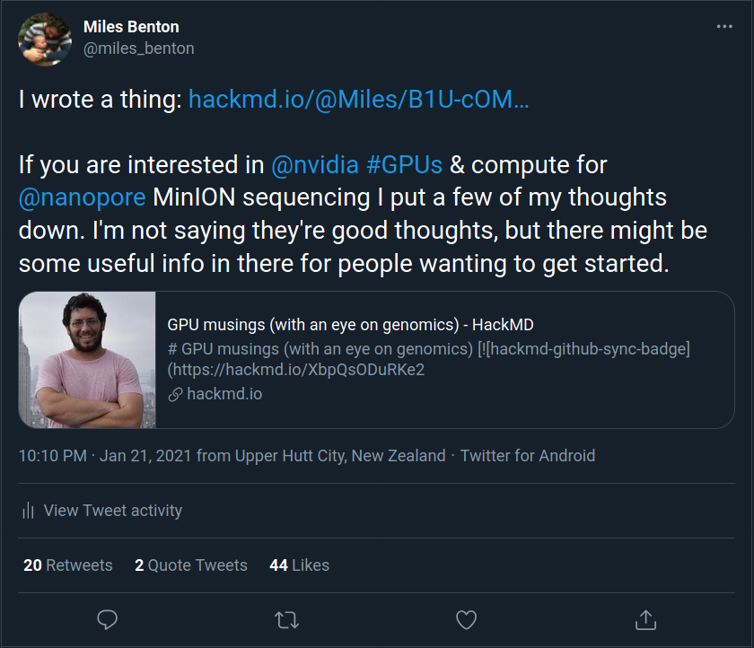
<br />
[GPU musings (with an eye on genomics)](https://hackmd.io/@Miles/B1U-cOMyu)
]

---

class: top

# acknowledgements

<div class="dt dt--fixed">
  <div class="dtc tc pv4 bg-white">
    <article class="mw5 center bg-white br3 pa3 pa4-ns mv3 ba b--black-10">
      <div class="tc">
        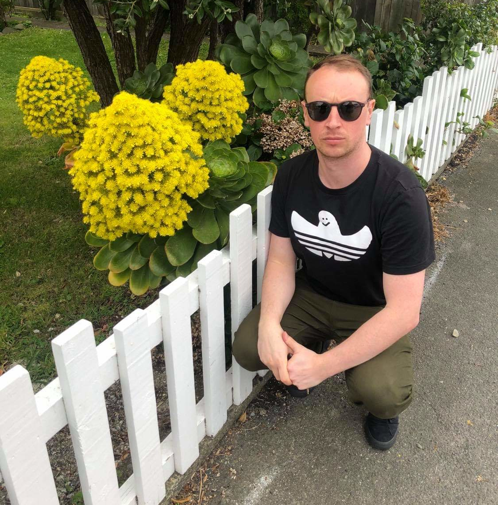
        <h4 class="f3 mb2">Matt Storey</h4>
        <h4 class="f5 fw4 gray mt0">(ESR)</h4>
      </div>
    </article>
  </div>
  <div class="dtc tc pv4 bg-white">
    <article class="mw5 center bg-white br3 pa3 pa4-ns mv3 ba b--black-10">
      <div class="tc">
        
        <h4 class="f3 mb2">Joep de Ligt</h4>
        <h4 class="f5 fw4 gray mt0">(ESR)</h4>
      </div>
    </article>
  </div>
  <div class="dtc tc pv4 bg-white">
    <article class="mw5 center bg-white br3 pa3 pa4-ns mv3 ba b--black-10">
      <div class="tc">
        
        <h4 class="f3 mb2">Donia Macartney-Coxson</h4>
        <h4 class="f5 fw4 gray mt0">(ESR)</h4>
      </div>
    </article>
  </div>
</div>

.pull-left[.medium[
**Georgia Bell** (ESR)  
Una Ren (ESR)  
Richard Dean (ESR)
]]

.pull-right[.medium[
Matthew Walton (ESR)  
Shane Sturrock (ESR)  
Russell Smithies (ESR)  
]]

---
layout: false
class: hide_logo

background-image: url("images/TaiHuaRoa.jpg")
background-size: contain
